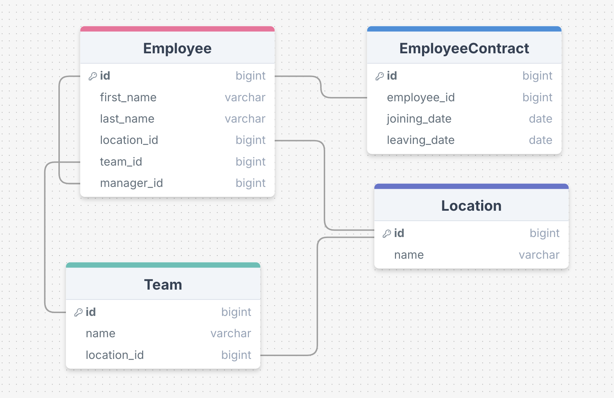
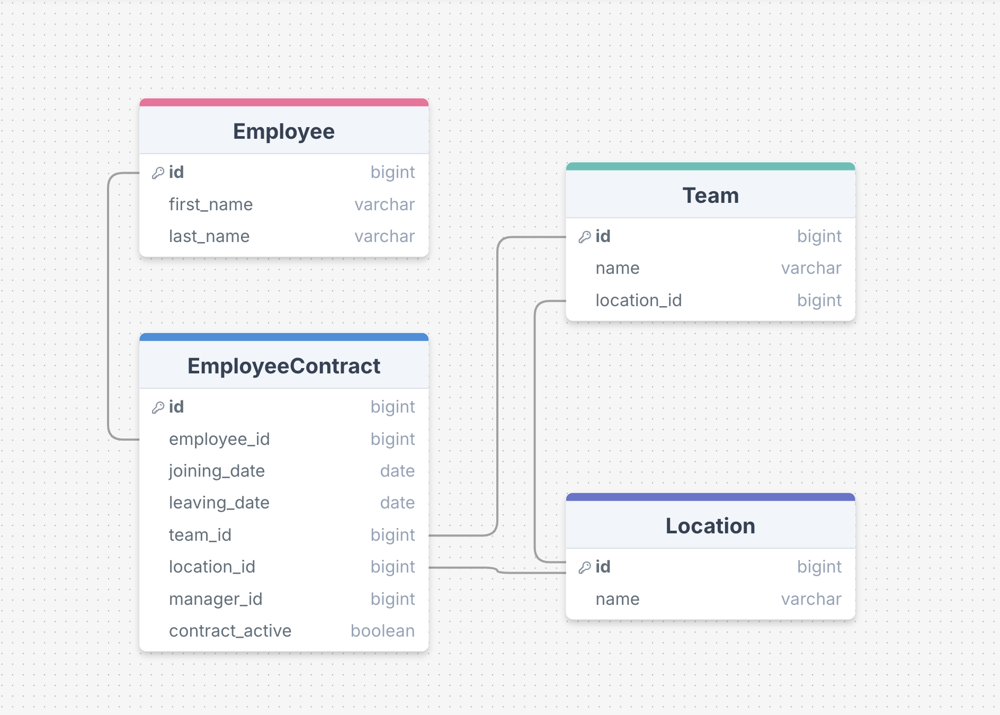
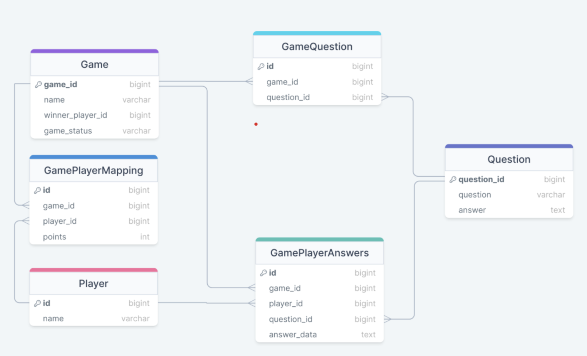
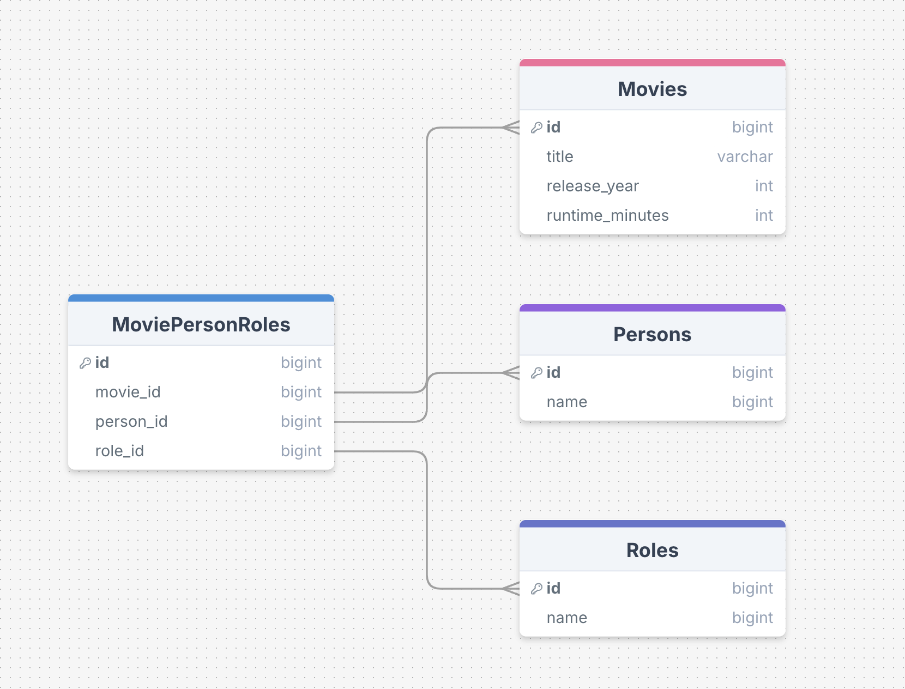
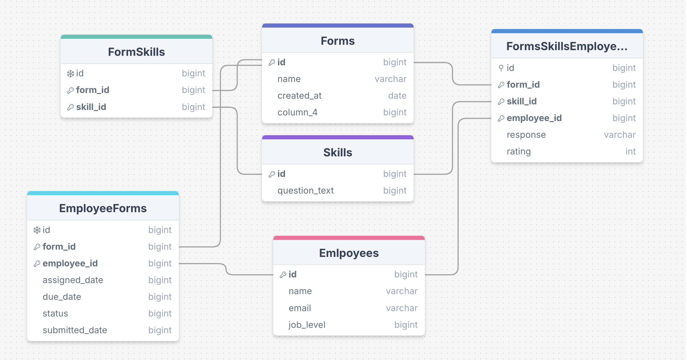

# tech-interview-prep
Everything you need for acing software engineering interviews—coding, system design, and more!

## Table of Contents

| Section                                  | Description                                   |
|------------------------------------------|-----------------------------------------------|
| [Data Structures and Algorithms](#data-structures-and-algorithms) | Covers key concepts and problem-solving techniques in DSA |
| [Low Level Design](#low-level-design)           | Principles and patterns for designing robust and scalable low-level systems |
| [API Design](#api-design)                | Best practices for designing effective APIs   |
| [Database Schema Design](#db-schema-design) | Guidelines for structuring database schemas   |
| [Design Patterns](#design-patterns)      | Common software design patterns and their applications |
| [Java Concurrency](#java-concurrency)    | Concurrency concepts and practices in Java    |
| [Machine Coding](#machine-coding)        | Real-time coding practices and problem-solving |
| [SQL](#sql)                              | SQL query writing, optimization, and best practices |
| [High Level Design](#high-level-design)          | Architecture and design principles for large systems |
| [AWS Concepts](#aws-concepts)            | Introduction to Amazon Web Services and key cloud concepts |
| [CS Fundamentals](#cs-fundamentals) | Core computer science concepts including Computer Networks, Operating Systems, and Database Management Systems |
| [Behavioral Interview](#behavioral-interview) | Strategies for effective behavioral interviews |
| [Asking Good Questions](#asking-good-questions) | Techniques for framing and asking insightful questions |
| [Leadership Skills](#leadership-skills)  | Building and demonstrating leadership in tech roles |
| [Communication Skills](#communication-skills) | Enhancing verbal and written communication    |
| [Salary Negotiations](#salary-negotiations) | Tips and strategies for negotiating salary    |
| [Resume](#resume)                        | Crafting an impactful resume                  |


---

## Data Structures and Algorithms

### Resources

| **YouTube Links** | **Blog Links** | **Course Links** | **GitHub Links** | **Google Docs/Spreadsheet Links** | **Screenshots** | **Notes** | **Book List** | **Reading List** |
|-------------------|----------------|------------------|------------------|-----------------------------------|-----------------|-----------|---------------|-----------------|
| [Introduction to DSA](https://www.youtube.com/...), [Advanced DSA Topics](https://www.youtube.com/...) | [Top 10 DSA Problems](https://exampleblog.com/dsa), [How to Master DSA](https://anotherblog.com/dsa-master) | [Udemy: DSA Masterclass](https://www.udemy.com/...), [Coursera: DSA Specialization](https://www.coursera.org/...) | [DSA Repo](https://github.com/user/dsa-prep), [Practice Problems](https://github.com/user/dsa-problems) | [DSA Cheat Sheet](https://docs.google.com/spreadsheets/d/...), [Common DSA Patterns](https://docs.google.com/document/d/...) |  | [DSA Notes](./notes/dsa_notes.md) | ["Algorithms" by Robert Sedgewick](https://www.amazon.com/...), ["Introduction to Algorithms" by Cormen](https://www.amazon.com/...) | [Articles to read](./reading-list/dsa_reading.md) |

### Topics

- **Sorting Algorithms**: Quick sort, merge sort, bubble sort, etc.
- **Data Structures**: Arrays, linked lists, trees, graphs, heaps.
- **Dynamic Programming**: Techniques and common problems.
- **Recursion**: Understanding and implementing recursive solutions.
- **Graph Algorithms**: BFS, DFS, Dijkstra's algorithm.

---

## Low Level Design

### Resources

| **YouTube Links** | **Blog Links** | **Course Links** | **GitHub Links** | **Google Docs/Spreadsheet Links** | **Screenshots** | **Notes** | **Book List** | **Reading List** |
|-------------------|----------------|------------------|------------------|-----------------------------------|-----------------|-----------|---------------|-----------------|
| [Low-Level Design Basics](https://www.youtube.com/...), [Object-Oriented Design Principles](https://www.youtube.com/...) | [LLD Best Practices](https://exampleblog.com/lld), [How to Approach LLD Problems](https://anotherblog.com/lld-approach) | [Udemy: LLD for Engineers](https://www.udemy.com/...), [Coursera: Object-Oriented Design](https://www.coursera.org/...) | [LLD Design Patterns](https://github.com/user/lld-patterns), [System Design Repos](https://github.com/user/system-design) | [LLD Guide](https://docs.google.com/spreadsheets/d/...), [Design Documentation](https://docs.google.com/document/d/...) |  | [LLD Notes](./notes/lld_notes.md) | ["Design Patterns: Elements of Reusable Object-Oriented Software" by GoF](https://www.amazon.com/...), ["Clean Code" by Robert Martin](https://www.amazon.com/...) | [LLD Articles](./reading-list/lld_reading.md) |

### Topics

- **Object-Oriented Principles**: SOLID principles, encapsulation, inheritance, polymorphism.
- **Design Patterns**: Singleton, factory, observer, strategy.
- **Code Modularity**: Creating modular and maintainable code.
- **UML Diagrams**: Class diagrams, sequence diagrams.
- **Case Studies**: Real-world applications of LLD.

---

## API Design

### Resources

| **YouTube Links** | **Blog Links** | **Course Links** | **GitHub Links** | **Google Docs/Spreadsheet Links** | **Screenshots** | **Notes** | **Book List** | **Reading List** |
|-------------------|----------------|------------------|------------------|-----------------------------------|-----------------|-----------|---------------|-----------------|
| [API Design Best Practices](https://www.youtube.com/...), [REST API Concepts](https://www.youtube.com/...) | [Principles of API Design](https://exampleblog.com/api-design), [How to Design REST APIs](https://anotherblog.com/rest-api-design) | [Udemy: API Design Mastery](https://www.udemy.com/...), [Coursera: RESTful API Design](https://www.coursera.org/...) | [API Design Examples](https://github.com/user/api-design-examples), [REST API Best Practices](https://github.com/user/rest-api-best-practices) | [API Design Checklist](https://docs.google.com/spreadsheets/d/...), [REST API Guide](https://docs.google.com/document/d/...) |  | [API Design Notes](./notes/api_notes.md) | ["RESTful Web APIs" by Leonard Richardson](https://www.amazon.com/...), ["Designing APIs with Swagger and OpenAPI"](https://www.amazon.com/...) | [API Articles](./reading-list/api_reading.md) |

### Topics

- **RESTful Design Principles**: Resource naming, statelessness, use of HTTP methods.
- **GraphQL**: Basics of GraphQL, differences from REST.
- **Versioning and Pagination**: Best practices for API versioning and managing large datasets.
- **Security**: Authentication, authorization, and data protection.
- **Error Handling**: Standardizing error messages and responses.

---

## Database Schema Design

### Resources

| **YouTube Links** | **Blog Links** | **Course Links** | **GitHub Links** | **Google Docs/Spreadsheet Links** | **Screenshots** | **Notes** | **Book List** | **Reading List** |
|-------------------|----------------|------------------|------------------|-----------------------------------|-----------------|-----------|---------------|-----------------|
| [Database Schema Design Basics](https://www.youtube.com/...), [Normalization Techniques](https://www.youtube.com/...) | [Top Schema Design Tips](https://exampleblog.com/schema-design), [Normalization vs. Denormalization](https://anotherblog.com/normalization) | [Udemy: Master Database Design](https://www.udemy.com/...), [Coursera: Relational Database Design](https://www.coursera.org/...) | [Schema Design Repo](https://github.com/user/schema-design), [Sample Schemas](https://github.com/user/sample-schemas) | [Database Schema Cheat Sheet](https://docs.google.com/spreadsheets/d/...), [ERD Examples](https://docs.google.com/document/d/...) |  | [Database Design Notes](./notes/db_schema_notes.md) | ["Database Design for Mere Mortals" by Michael Hernandez](https://www.amazon.com/...), ["SQL Antipatterns" by Bill Karwin](https://www.amazon.com/...) | [Schema Design Articles](./reading-list/db_schema_reading.md) |

### Topics

- **Normalization**: 1NF, 2NF, 3NF, and BCNF.
- **Denormalization**: When and why to denormalize.
- **Entity-Relationship Diagrams (ERDs)**:
- **Relationships such as Primary Key and Foreign Key**:
- Concepts include 1-1, 1-many, many-many, bridge tables, and self-referencing tables.

 Designing ERDs and translating them into schemas.
- **Indexes and Keys**: Use of primary, foreign, and composite keys.
- **Data Modeling**: Best practices for modeling data relationships.

### Database Schema Design Guide

##### Step 1: Identify Entities
- Identify the main entities in your system. These will typically become tables in your database.
Example: Movie, Person, Role

##### Step 2: Define Attributes
- For each entity, list its attributes. These will become columns in your tables. Include primary keys and unique identifiers.   
Example:
- Movie: id, title, release_year, runtime_minutes
- Person: id, name, birth_date
- Role: id, role_name

##### Step 3: Determine Relationships
Identify how entities relate to each other. There are three main types of relationships:

1. One-to-One (1:1)
2. One-to-Many (1:N)
3. Many-to-Many (M:N)

Example:
- A Person can have many Roles in many Movies (M:N)
- A Movie can have many Persons in many Roles (M:N)

##### Step 4: Implement Relationships

###### One-to-One (1:1)
- Use a foreign key in one of the tables to reference the primary key of the other.
- Add a unique constraint on the foreign key.

Example:
```sql
CREATE TABLE UserProfile (
    user_id INTEGER PRIMARY KEY,
    profile_data TEXT,
    CONSTRAINT fk_user FOREIGN KEY (user_id) REFERENCES Users(id),
    CONSTRAINT uk_user_profile UNIQUE (user_id)
);
```

###### One-to-Many (1:N)
- Add a foreign key in the "many" table referencing the "one" table.

Example:
```sql
CREATE TABLE Posts (
    id SERIAL PRIMARY KEY,
    user_id INTEGER,
    content TEXT,
    CONSTRAINT fk_user FOREIGN KEY (user_id) REFERENCES Users(id)
);
```

###### Many-to-Many (M:N)
- Create a junction (bridge) table that references both entities.

``````
##### Intuition for Junction Tables

The need for a junction table arises when you have a many-to-many relationship between entities. Here's how to recognize and implement them:

1. Identify the relationship: If you find yourself saying "A can have many B, and B can have many A", you likely need a junction table.
2. Check for additional information: If the relationship itself needs to store data, this confirms the need for a junction table.
3. Create the junction table: Name it after both entities (e.g., MoviePersonRoles) and include foreign keys to both entities.
4. Add any relationship-specific attributes to the junction table.

Example: MoviePersonRoles

1. Identify the relationship:
- A Person can be in many Movies
- A Movie can have many Persons
- A Person can have different Roles in different Movies

2. Check for additional information:
- We need to store which Role a Person had in a specific Movie
- We might want to store character names for actors

3. Create the junction table:
   ```sql
   CREATE TABLE MoviePersonRoles (
       movie_id INTEGER,
       person_id INTEGER,
       role_id INTEGER,
       character_name VARCHAR(255),
       PRIMARY KEY (movie_id, person_id, role_id),
       CONSTRAINT fk_movie FOREIGN KEY (movie_id) REFERENCES Movies(id),
       CONSTRAINT fk_person FOREIGN KEY (person_id) REFERENCES Persons(id),
       CONSTRAINT fk_role FOREIGN KEY (role_id) REFERENCES Roles(id)
   );
   ```

4. Add relationship-specific attributes:
- We added `character_name` to store the character an actor played in a specific movie.

``````

###### Self-Referencing Tables
- Use when an entity has a relationship with itself (e.g., employees and managers).

Example:
```sql
CREATE TABLE Employees (
    id SERIAL PRIMARY KEY,
    name VARCHAR(100),
    manager_id INTEGER,
    CONSTRAINT fk_manager FOREIGN KEY (manager_id) REFERENCES Employees(id)
);
```

##### Step 5: Normalize the Schema
Apply normalization rules to reduce data redundancy and improve data integrity.
  - First Normal Form (1NF): Eliminate repeating groups
  - Second Normal Form (2NF): Remove partial dependencies
  - Third Normal Form (3NF): Remove transitive dependencies

##### Step 6: Add Constraints
Add constraints to ensure data integrity:
  - Primary Keys
  - Foreign Keys
  - Unique Constraints
  - Check Constraints

##### Step 7: Consider Indexing
Add indexes to columns that will be frequently searched or joined.

Example:
```sql
CREATE INDEX idx_movie_title ON Movies(title);
CREATE INDEX idx_person_name ON Persons(name);
```


### Questions

#### Q.1(a)
- Design a relational database schema for employees of an organisation. The information we want to store is:
    - first name
    - last name
    - display name (first name + last name)
    - joining date
    - leaving date   
    - reporting manager
    - team name
    - location (location of employee residence)
    - office location



~~~~sql

CREATE TABLE employees (
    id BIGINT PRIMARY KEY,
    first_name VARCHAR(50),
    last_name VARCHAR(50),
    manager_id BIGINT,
    team_id BIGINT,
    location_id BIGINT,
    FOREIGN KEY (manager_id) REFERENCES employees(id),
    FOREIGN KEY (team_id) REFERENCES teams(id),
    FOREIGN KEY (location_id) REFERENCES locations(id)
);

CREATE TABLE employee_contract (
    id INT PRIMARY KEY,
    joining_date DATE,
    leaving_date DATE,
    employee_id BIGINT,
    FOREIGN KEY (employee_id) REFERENCES employees(id)
);

CREATE TABLE teams (
    id BIGINT PRIMARY KEY,
    name VARCHAR(50),
    location_id BIGINT,
    FOREIGN KEY (location_id) REFERENCES locations(id)
);

CREATE TABLE locations (
    id BIGINT PRIMARY KEY,
    name VARCHAR(50)
);
~~~~

#### Q.1(b)
- Employee can come back to rejoin the company. Design schema to store an employee's past and present data without removing or duplicating information?


~~~~sql
CREATE TABLE employees (
    id BIGINT PRIMARY KEY,
    first_name VARCHAR(50),
    last_name VARCHAR(50),
);

CREATE TABLE employee_contract (
    id INT PRIMARY KEY,
    manager_id BIGINT,
    team_id BIGINT,
    location_id BIGINT,
    joining_date DATE,
    leaving_date DATE,
    employee_id BIGINT,
    FOREIGN KEY (manager_id) REFERENCES employees(id),
    FOREIGN KEY (team_id) REFERENCES teams(id),
    FOREIGN KEY (location_id) REFERENCES locations(id),
    FOREIGN KEY (employee_id) REFERENCES employees(id)
);

CREATE TABLE teams (
    id BIGINT PRIMARY KEY,
    name VARCHAR(50),
    location_id BIGINT,
    FOREIGN KEY (location_id) REFERENCES locations(id)
);

CREATE TABLE locations (
    id BIGINT PRIMARY KEY,
    name VARCHAR(50)
);
~~~~

#### Q.2

- Multiplayer Game DB: Design ER Diagram for a multiplayer game app, having the following requirements:
  - Player data
  - Question data
  - Trivia Game data - Combines multiple questions
  - Map game to players - Player can participate in multiple games
  - Table to maintain all the players answers for each game



~~~~sql
-- Players table
CREATE TABLE Players (
    player_id SERIAL PRIMARY KEY,
    username VARCHAR(50) UNIQUE NOT NULL,
    email VARCHAR(100) UNIQUE NOT NULL,
    password_hash VARCHAR(255) NOT NULL,
    created_at TIMESTAMP DEFAULT CURRENT_TIMESTAMP
);

-- Games table
CREATE TABLE Games (
    game_id SERIAL PRIMARY KEY,
    game_name VARCHAR(100) NOT NULL,
    start_time TIMESTAMP,
    end_time TIMESTAMP,
    max_players INTEGER,
    status VARCHAR(20) CHECK (status IN ('pending', 'active', 'completed'))
);

-- GamePlayerAnswers table (Maintains all player answers for each game)
CREATE TABLE GamePlayerAnswers (
    answer_id SERIAL PRIMARY KEY,
    game_id INTEGER,
    player_id INTEGER,
    question_id INTEGER,
    player_answer VARCHAR(255),
    is_correct BOOLEAN,
    answer_time TIMESTAMP DEFAULT CURRENT_TIMESTAMP,
    UNIQUE (game_id, player_id, question_id),
    FOREIGN KEY (game_id) REFERENCES Games(game_id),
    FOREIGN KEY (player_id) REFERENCES Players(player_id),
    FOREIGN KEY (question_id) REFERENCES Questions(question_id)
);

-- GamePlayerMapping table (Maps games to players)
CREATE TABLE GamePlayerMapping (
    game_id INTEGER REFERENCES Games(game_id),
    player_id INTEGER REFERENCES Players(player_id),
    join_time TIMESTAMP DEFAULT CURRENT_TIMESTAMP,
    score INTEGER DEFAULT 0,
    PRIMARY KEY (game_id, player_id),
    FOREIGN KEY (game_id) REFERENCES Games(game_id),
    FOREIGN KEY (player_id) REFERENCES Players(player_id)
);

-- Questions table
CREATE TABLE Questions (
    question_id SERIAL PRIMARY KEY,
    question_text TEXT NOT NULL,
    correct_answer VARCHAR(255) NOT NULL,
    difficulty_level INTEGER CHECK (difficulty_level BETWEEN 1 AND 10),
    category VARCHAR(50)
);

-- Table to associate questions with games
CREATE TABLE GameQuestions (
    game_id INTEGER,
    question_id INTEGER,
    PRIMARY KEY (game_id, question_id),
    CONSTRAINT fk_gamequestions_game FOREIGN KEY (game_id) REFERENCES Games(game_id),
    CONSTRAINT fk_gamequestions_question FOREIGN KEY (question_id) REFERENCES Questions(question_id)
);
~~~~

#### Q.3(a)

- Design a database so that we can model:
  - Movie
  - Person
  - Role on movie (Actor, producer, Storywriter etc)

The schema should allow us to answer the following questions. 
  - Give me all the movies that an actor has been in?
  - Give me all the movies by director?
  - List the names of all the camera assistants for a movie?

#### Q.3(b)
- What could we do at the database to speed these queries up?



~~~~sql
-- Movies table
CREATE TABLE Movies (
    movie_id SERIAL PRIMARY KEY,
    title VARCHAR(255) NOT NULL,
    release_year INTEGER,
    runtime_minutes INTEGER,
    CONSTRAINT uk_movies_title_year UNIQUE (title, release_year)
);

-- Persons table
CREATE TABLE Persons (
    person_id SERIAL PRIMARY KEY,
    name VARCHAR(255) NOT NULL,
    birth_date DATE,
    CONSTRAINT uk_persons_name UNIQUE (name)
);

-- Roles table
CREATE TABLE Roles (
    role_id SERIAL PRIMARY KEY,
    role_name VARCHAR(50) NOT NULL,
    CONSTRAINT uk_roles_name UNIQUE (role_name)
);

-- MoviePersonRoles table (junction table)
CREATE TABLE MoviePersonRoles (
    movie_id INTEGER,
    person_id INTEGER,
    role_id INTEGER,
    character_name VARCHAR(255),
    PRIMARY KEY (movie_id, person_id, role_id),
    CONSTRAINT fk_moviepersonroles_movie FOREIGN KEY (movie_id) REFERENCES Movies(movie_id),
    CONSTRAINT fk_moviepersonroles_person FOREIGN KEY (person_id) REFERENCES Persons(person_id),
    CONSTRAINT fk_moviepersonroles_role FOREIGN KEY (role_id) REFERENCES Roles(role_id)
);

-- Create indexes for performance
CREATE INDEX idx_persons_name ON Persons(name);
CREATE INDEX idx_moviepersonroles_person_role ON MoviePersonRoles(person_id, role_id);
CREATE INDEX idx_movies_title ON Movies(title);

-- Partitioning for large tables
-- Optimizing queries


~~~~


#### Q.4
- Design a relational database schema for Employee Performance Review System, to maintain:
   - Employee data
   - Skill data
   - Forms → by combining multiple skills
   - Map Form to Employees → One employee can be assigned multiple forms
   - Table to maintain the user entered response for a form against each skill


~~~~sql

-- Employees table
CREATE TABLE Employees (
    employee_id SERIAL PRIMARY KEY,
    first_name VARCHAR(50) NOT NULL,
    last_name VARCHAR(50) NOT NULL,
    email VARCHAR(100) NOT NULL,
    hire_date DATE NOT NULL,
    department VARCHAR(50),
    CONSTRAINT uk_employees_email UNIQUE (email)
);

-- Skills table
CREATE TABLE Skills (
    skill_id SERIAL PRIMARY KEY,
    skill_name VARCHAR(100) NOT NULL,
    description TEXT,
    CONSTRAINT uk_skills_name UNIQUE (skill_name)
);

-- Forms table
CREATE TABLE Forms (
    form_id SERIAL PRIMARY KEY,
    form_name VARCHAR(100) NOT NULL,
    description TEXT,
    created_at TIMESTAMP DEFAULT CURRENT_TIMESTAMP,
    CONSTRAINT uk_forms_name UNIQUE (form_name)
);

-- FormSkills table (junction table for Forms and Skills)
CREATE TABLE FormSkills (
    form_id INTEGER,
    skill_id INTEGER,
    skill_order INTEGER NOT NULL,
    PRIMARY KEY (form_id, skill_id),
    CONSTRAINT fk_formskills_form FOREIGN KEY (form_id) REFERENCES Forms(form_id),
    CONSTRAINT fk_formskills_skill FOREIGN KEY (skill_id) REFERENCES Skills(skill_id)
);

-- EmployeeForms table (junction table for Employees and Forms)
CREATE TABLE EmployeeForms (
    employee_id INTEGER,
    form_id INTEGER,
    assigned_date DATE NOT NULL,
    due_date DATE,
    status VARCHAR(20) CHECK (status IN ('pending', 'in_progress', 'completed')),
    PRIMARY KEY (employee_id, form_id),
    CONSTRAINT fk_employeeforms_employee FOREIGN KEY (employee_id) REFERENCES Employees(employee_id),
    CONSTRAINT fk_employeeforms_form FOREIGN KEY (form_id) REFERENCES Forms(form_id)
);

-- SkillResponses table
CREATE TABLE SkillResponses (
    response_id SERIAL PRIMARY KEY,
    employee_id INTEGER,
    form_id INTEGER,
    skill_id INTEGER,
    rating INTEGER CHECK (rating BETWEEN 1 AND 5),
    comment TEXT,
    submitted_at TIMESTAMP DEFAULT CURRENT_TIMESTAMP,
    CONSTRAINT fk_skillresponses_employee FOREIGN KEY (employee_id) REFERENCES Employees(employee_id),
    CONSTRAINT fk_skillresponses_form FOREIGN KEY (form_id) REFERENCES Forms(form_id),
    CONSTRAINT fk_skillresponses_skill FOREIGN KEY (skill_id) REFERENCES Skills(skill_id),
    CONSTRAINT uk_skillresponses_employee_form_skill UNIQUE (employee_id, form_id, skill_id)
);

-- Create indexes for performance
CREATE INDEX idx_employees_department ON Employees(department);
CREATE INDEX idx_formskills_form_skill ON FormSkills(form_id, skill_id);
CREATE INDEX idx_employeeforms_employee_status ON EmployeeForms(employee_id, status);
CREATE INDEX idx_skillresponses_employee_form ON SkillResponses(employee_id, form_id);
~~~~

#### Q.5
- Design a schema for a chatting service to allow users to:
   - Send direct messages
   - Send group messages
   - Send replies aka have threads for a specific direct or group message

~~~~sql
-- Users Table
CREATE TABLE Users (
    user_id SERIAL PRIMARY KEY,
    username VARCHAR(50) UNIQUE NOT NULL,
    email VARCHAR(100) UNIQUE NOT NULL,
    password_hash VARCHAR(255) NOT NULL,
    created_at TIMESTAMP DEFAULT CURRENT_TIMESTAMP
);

-- Conversations Table (for both direct and group chats)
CREATE TABLE Conversations (
    conversation_id SERIAL PRIMARY KEY,
    conversation_name VARCHAR(100),
    is_group_chat BOOLEAN NOT NULL,
    created_at TIMESTAMP DEFAULT CURRENT_TIMESTAMP
);

-- Conversation Participants Table
CREATE TABLE ConversationParticipants (
    conversation_id INTEGER REFERENCES Conversations(conversation_id),
    user_id INTEGER REFERENCES Users(user_id),
    joined_at TIMESTAMP DEFAULT CURRENT_TIMESTAMP,
    PRIMARY KEY (conversation_id, user_id)
);

-- Messages Table
CREATE TABLE Messages (
    message_id SERIAL PRIMARY KEY,
    conversation_id INTEGER REFERENCES Conversations(conversation_id),
    sender_id INTEGER REFERENCES Users(user_id),
    content TEXT NOT NULL,
    sent_at TIMESTAMP DEFAULT CURRENT_TIMESTAMP,
    parent_message_id INTEGER REFERENCES Messages(message_id)
);

-- Indexes for performance
CREATE INDEX idx_messages_conversation_id ON Messages(conversation_id);
CREATE INDEX idx_messages_parent_message_id ON Messages(parent_message_id);
CREATE INDEX idx_conversation_participants_user_id ON ConversationParticipants(user_id);

/*
Explanation of how this design allows each functionality:

1. Send direct messages:
   - Create a Conversation with is_group_chat set to FALSE.
   - Add two users to the ConversationParticipants table for this conversation.
   - Users can then send messages by inserting rows into the Messages table with the corresponding conversation_id.

2. Send group messages:
   - Create a Conversation with is_group_chat set to TRUE.
   - Add multiple users to the ConversationParticipants table for this conversation.
   - Users can send messages to the group by inserting rows into the Messages table with the corresponding conversation_id.

3. Send replies (threads):
   - When sending a reply, insert a new row in the Messages table with the parent_message_id set to the message_id of the message being replied to.
   - This creates a hierarchical structure of messages, allowing for threaded conversations.
   - Replies can be made to both direct and group messages, as the parent_message_id is independent of the conversation type.

*/
~~~~

#### Q.6
- Design the database schema for maintaining the information about the students, courses and grades acquired by the students. It is a small school and there is no concept of departments e.g. Computer Science, Electronics, etc. Below are types of requests which principal is expecting from parents/students in future which need to be served:
  1. What was the grade of the student S for course C?
  2. List all courses are taken by student S?
  3. What all course were taught in semester S?  

In order to serve above requests, he/she want to store the below data/info:  
   1. first name
   2. last name
   3. display name (first name + last name)
   4. course name
   5. course code
   6. credits
   7. prerequisite course
   8. instructor
   9. semester
   10. year
   11. grade

- How will we handle cases where?
  - Particular course has another course as prerequisites.
  - Particular course has multiple active courses as prerequisites.

~~~~sql

-- Create Students table
CREATE TABLE Students (
    student_id INT PRIMARY KEY AUTO_INCREMENT,
    first_name VARCHAR(50) NOT NULL,
    last_name VARCHAR(50) NOT NULL,
    display_name VARCHAR(100) GENERATED ALWAYS AS (CONCAT(first_name, ' ', last_name)) STORED
);

-- Create Courses table
CREATE TABLE Courses (
    course_id INT PRIMARY KEY AUTO_INCREMENT,
    course_name VARCHAR(100) NOT NULL,
    course_code VARCHAR(20) UNIQUE NOT NULL,
    credits INT NOT NULL
);

-- Create Prerequisites table
CREATE TABLE Prerequisites (
    prerequisite_id INT PRIMARY KEY AUTO_INCREMENT,
    course_id INT,
    prerequisite_course_id INT,
    FOREIGN KEY (course_id) REFERENCES Courses(course_id),
    FOREIGN KEY (prerequisite_course_id) REFERENCES Courses(course_id)
);

-- Create Instructors table
CREATE TABLE Instructors (
    instructor_id INT PRIMARY KEY AUTO_INCREMENT,
    first_name VARCHAR(50) NOT NULL,
    last_name VARCHAR(50) NOT NULL,
    display_name VARCHAR(100) GENERATED ALWAYS AS (CONCAT(first_name, ' ', last_name)) STORED
);

-- Create Enrollments table
CREATE TABLE Enrollments (
    enrollment_id INT PRIMARY KEY AUTO_INCREMENT,
    student_id INT,
    course_id INT,
    instructor_id INT,
    semester VARCHAR(20) NOT NULL,
    year INT NOT NULL,
    grade VARCHAR(2),
    FOREIGN KEY (student_id) REFERENCES Students(student_id),
    FOREIGN KEY (course_id) REFERENCES Courses(course_id),
    FOREIGN KEY (instructor_id) REFERENCES Instructors(instructor_id)
);

-- Indexes to improve query performance
CREATE INDEX idx_enrollments_student ON Enrollments(student_id);
CREATE INDEX idx_enrollments_course ON Enrollments(course_id);
CREATE INDEX idx_enrollments_semester_year ON Enrollments(semester, year);
CREATE INDEX idx_prerequisites_course ON Prerequisites(course_id);

-- Sample queries to address the principal's requests:

-- 1. What was the grade of the student S for course C?
-- SELECT e.grade
-- FROM Enrollments e
-- JOIN Students s ON e.student_id = s.student_id
-- JOIN Courses c ON e.course_id = c.course_id
-- WHERE s.display_name = 'Student Name' AND c.course_code = 'COURSE_CODE';

-- 2. List all courses taken by student S?
-- SELECT c.course_name, c.course_code, e.semester, e.year
-- FROM Enrollments e
-- JOIN Students s ON e.student_id = s.student_id
-- JOIN Courses c ON e.course_id = c.course_id
-- WHERE s.display_name = 'Student Name';

-- 3. What all courses were taught in semester S?
-- SELECT DISTINCT c.course_name, c.course_code, i.display_name AS instructor
-- FROM Enrollments e
-- JOIN Courses c ON e.course_id = c.course_id
-- JOIN Instructors i ON e.instructor_id = i.instructor_id
-- WHERE e.semester = 'Fall' AND e.year = 2023;

-- 4. List all prerequisites for a specific course
-- SELECT p.course_name AS prerequisite_course
-- FROM Prerequisites pr
-- JOIN Courses c ON pr.course_id = c.course_id
-- JOIN Courses p ON pr.prerequisite_course_id = p.course_id
-- WHERE c.course_code = 'COURSE_CODE';
~~~~

#### Q.7
- Design DB for a shared shopping cart experience for multiple online stores. Following are the requirements:
It is multi tenant. That is all data lives in one database.
The schema should include everything from a User signs in, all the way until check-out. Billing is explicitly out of scope as that is handled by PayFriend.

~~~~sql

-- Multi-tenant Shared Shopping Cart Database Schema

-- Tenants (Online Stores)
CREATE TABLE tenants (
    tenant_id SERIAL PRIMARY KEY,
    store_name VARCHAR(255) NOT NULL,
    domain VARCHAR(255) UNIQUE NOT NULL,
    created_at TIMESTAMP WITH TIME ZONE DEFAULT CURRENT_TIMESTAMP
);

-- Users
CREATE TABLE users (
    user_id SERIAL PRIMARY KEY,
    tenant_id INTEGER REFERENCES tenants(tenant_id),
    email VARCHAR(255) NOT NULL,
    password_hash VARCHAR(255) NOT NULL,
    first_name VARCHAR(100),
    last_name VARCHAR(100),
    created_at TIMESTAMP WITH TIME ZONE DEFAULT CURRENT_TIMESTAMP,
    UNIQUE (tenant_id, email)
);

-- Products
CREATE TABLE products (
    product_id SERIAL PRIMARY KEY,
    tenant_id INTEGER REFERENCES tenants(tenant_id),
    name VARCHAR(255) NOT NULL,
    description TEXT,
    price DECIMAL(10, 2) NOT NULL,
    stock_quantity INTEGER NOT NULL,
    created_at TIMESTAMP WITH TIME ZONE DEFAULT CURRENT_TIMESTAMP
);

-- Shopping Carts
CREATE TABLE shopping_carts (
    cart_id SERIAL PRIMARY KEY,
    user_id INTEGER REFERENCES users(user_id),
    tenant_id INTEGER REFERENCES tenants(tenant_id),
    created_at TIMESTAMP WITH TIME ZONE DEFAULT CURRENT_TIMESTAMP,
    last_updated TIMESTAMP WITH TIME ZONE DEFAULT CURRENT_TIMESTAMP
);

-- Cart Items
CREATE TABLE cart_items (
    cart_item_id SERIAL PRIMARY KEY,
    cart_id INTEGER REFERENCES shopping_carts(cart_id),
    product_id INTEGER REFERENCES products(product_id),
    quantity INTEGER NOT NULL,
    added_at TIMESTAMP WITH TIME ZONE DEFAULT CURRENT_TIMESTAMP
);

-- Orders
CREATE TABLE orders (
    order_id SERIAL PRIMARY KEY,
    user_id INTEGER REFERENCES users(user_id),
    tenant_id INTEGER REFERENCES tenants(tenant_id),
    total_amount DECIMAL(10, 2) NOT NULL,
    status VARCHAR(50) NOT NULL,
    created_at TIMESTAMP WITH TIME ZONE DEFAULT CURRENT_TIMESTAMP
);

-- Order Items
CREATE TABLE order_items (
    order_item_id SERIAL PRIMARY KEY,
    order_id INTEGER REFERENCES orders(order_id),
    product_id INTEGER REFERENCES products(product_id),
    quantity INTEGER NOT NULL,
    price_at_time DECIMAL(10, 2) NOT NULL
);

-- Shipping Addresses
CREATE TABLE shipping_addresses (
    address_id SERIAL PRIMARY KEY,
    user_id INTEGER REFERENCES users(user_id),
    address_line1 VARCHAR(255) NOT NULL,
    address_line2 VARCHAR(255),
    city VARCHAR(100) NOT NULL,
    state VARCHAR(100),
    country VARCHAR(100) NOT NULL,
    postal_code VARCHAR(20) NOT NULL,
    is_default BOOLEAN DEFAULT false
);

-- Order Shipping
CREATE TABLE order_shipping (
    order_shipping_id SERIAL PRIMARY KEY,
    order_id INTEGER REFERENCES orders(order_id),
    address_id INTEGER REFERENCES shipping_addresses(address_id),
    shipping_method VARCHAR(100) NOT NULL,
    tracking_number VARCHAR(100)
);

-- Indexes for performance
CREATE INDEX idx_users_tenant_id ON users(tenant_id);
CREATE INDEX idx_products_tenant_id ON products(tenant_id);
CREATE INDEX idx_shopping_carts_user_id ON shopping_carts(user_id);
CREATE INDEX idx_shopping_carts_tenant_id ON shopping_carts(tenant_id);
CREATE INDEX idx_cart_items_cart_id ON cart_items(cart_id);
CREATE INDEX idx_orders_user_id ON orders(user_id);
CREATE INDEX idx_orders_tenant_id ON orders(tenant_id);
CREATE INDEX idx_order_items_order_id ON order_items(order_id);
CREATE INDEX idx_shipping_addresses_user_id ON shipping_addresses(user_id);

~~~~

Handle a customer complaint that they put their item in their cart and then the price was different at check out time, she wants to know how this could happen?
OR
Inventory person at one store noticed that he updated an inventory Items price but there were items sold after that point in time that were sold at the old price? How could that happen?

Update the design to fix the issue in both cases

~~~~sql

-- Multi-tenant Shared Shopping Cart Database Schema (Updated for MySQL)

-- Tenants (Online Stores)
CREATE TABLE tenants (
    tenant_id INT AUTO_INCREMENT PRIMARY KEY,
    store_name VARCHAR(255) NOT NULL,
    domain VARCHAR(255) UNIQUE NOT NULL,
    created_at TIMESTAMP DEFAULT CURRENT_TIMESTAMP
) ENGINE=InnoDB;

-- Users
CREATE TABLE users (
    user_id INT AUTO_INCREMENT PRIMARY KEY,
    tenant_id INT,
    email VARCHAR(255) NOT NULL,
    password_hash VARCHAR(255) NOT NULL,
    first_name VARCHAR(100),
    last_name VARCHAR(100),
    created_at TIMESTAMP DEFAULT CURRENT_TIMESTAMP,
    UNIQUE KEY (tenant_id, email),
    FOREIGN KEY (tenant_id) REFERENCES tenants(tenant_id)
) ENGINE=InnoDB;

-- Products
CREATE TABLE products (
    product_id INT AUTO_INCREMENT PRIMARY KEY,
    tenant_id INT,
    name VARCHAR(255) NOT NULL,
    description TEXT,
    created_at TIMESTAMP DEFAULT CURRENT_TIMESTAMP,
    FOREIGN KEY (tenant_id) REFERENCES tenants(tenant_id)
) ENGINE=InnoDB;

-- Product Prices (New table to track price history)
CREATE TABLE product_prices (
    price_id INT AUTO_INCREMENT PRIMARY KEY,
    product_id INT,
    price DECIMAL(10, 2) NOT NULL,
    effective_from TIMESTAMP DEFAULT CURRENT_TIMESTAMP,
    effective_to TIMESTAMP NULL,
    FOREIGN KEY (product_id) REFERENCES products(product_id)
) ENGINE=InnoDB;

-- Product Inventory (New table to track inventory history)
CREATE TABLE product_inventory (
    inventory_id INT AUTO_INCREMENT PRIMARY KEY,
    product_id INT,
    stock_quantity INT NOT NULL,
    effective_from TIMESTAMP DEFAULT CURRENT_TIMESTAMP,
    effective_to TIMESTAMP NULL,
    FOREIGN KEY (product_id) REFERENCES products(product_id)
) ENGINE=InnoDB;

-- Shopping Carts
CREATE TABLE shopping_carts (
    cart_id INT AUTO_INCREMENT PRIMARY KEY,
    user_id INT,
    tenant_id INT,
    created_at TIMESTAMP DEFAULT CURRENT_TIMESTAMP,
    last_updated TIMESTAMP DEFAULT CURRENT_TIMESTAMP ON UPDATE CURRENT_TIMESTAMP,
    FOREIGN KEY (user_id) REFERENCES users(user_id),
    FOREIGN KEY (tenant_id) REFERENCES tenants(tenant_id)
) ENGINE=InnoDB;

-- Cart Items (Updated to include price at the time of adding)
CREATE TABLE cart_items (
    cart_item_id INT AUTO_INCREMENT PRIMARY KEY,
    cart_id INT,
    product_id INT,
    quantity INT NOT NULL,
    price_at_add DECIMAL(10, 2) NOT NULL,
    added_at TIMESTAMP DEFAULT CURRENT_TIMESTAMP,
    FOREIGN KEY (cart_id) REFERENCES shopping_carts(cart_id),
    FOREIGN KEY (product_id) REFERENCES products(product_id)
) ENGINE=InnoDB;

-- Orders
CREATE TABLE orders (
    order_id INT AUTO_INCREMENT PRIMARY KEY,
    user_id INT,
    tenant_id INT,
    total_amount DECIMAL(10, 2) NOT NULL,
    status VARCHAR(50) NOT NULL,
    created_at TIMESTAMP DEFAULT CURRENT_TIMESTAMP,
    FOREIGN KEY (user_id) REFERENCES users(user_id),
    FOREIGN KEY (tenant_id) REFERENCES tenants(tenant_id)
) ENGINE=InnoDB;

-- Order Items (No changes needed here)
CREATE TABLE order_items (
    order_item_id INT AUTO_INCREMENT PRIMARY KEY,
    order_id INT,
    product_id INT,
    quantity INT NOT NULL,
    price_at_time DECIMAL(10, 2) NOT NULL,
    FOREIGN KEY (order_id) REFERENCES orders(order_id),
    FOREIGN KEY (product_id) REFERENCES products(product_id)
) ENGINE=InnoDB;

-- Shipping Addresses
CREATE TABLE shipping_addresses (
    address_id INT AUTO_INCREMENT PRIMARY KEY,
    user_id INT,
    address_line1 VARCHAR(255) NOT NULL,
    address_line2 VARCHAR(255),
    city VARCHAR(100) NOT NULL,
    state VARCHAR(100),
    country VARCHAR(100) NOT NULL,
    postal_code VARCHAR(20) NOT NULL,
    is_default BOOLEAN DEFAULT false,
    FOREIGN KEY (user_id) REFERENCES users(user_id)
) ENGINE=InnoDB;

-- Order Shipping
CREATE TABLE order_shipping (
    order_shipping_id INT AUTO_INCREMENT PRIMARY KEY,
    order_id INT,
    address_id INT,
    shipping_method VARCHAR(100) NOT NULL,
    tracking_number VARCHAR(100),
    FOREIGN KEY (order_id) REFERENCES orders(order_id),
    FOREIGN KEY (address_id) REFERENCES shipping_addresses(address_id)
) ENGINE=InnoDB;

-- Indexes for performance
CREATE INDEX idx_users_tenant_id ON users(tenant_id);
CREATE INDEX idx_products_tenant_id ON products(tenant_id);
CREATE INDEX idx_product_prices_product_id ON product_prices(product_id);
CREATE INDEX idx_product_inventory_product_id ON product_inventory(product_id);
CREATE INDEX idx_shopping_carts_user_id ON shopping_carts(user_id);
CREATE INDEX idx_shopping_carts_tenant_id ON shopping_carts(tenant_id);
CREATE INDEX idx_cart_items_cart_id ON cart_items(cart_id);
CREATE INDEX idx_orders_user_id ON orders(user_id);
CREATE INDEX idx_orders_tenant_id ON orders(tenant_id);
CREATE INDEX idx_order_items_order_id ON order_items(order_id);
CREATE INDEX idx_shipping_addresses_user_id ON shipping_addresses(user_id);

-- Function to get the current price of a product
DELIMITER //
CREATE FUNCTION get_current_product_price(p_product_id INT) 
RETURNS DECIMAL(10, 2)
READS SQL DATA
BEGIN
    DECLARE current_price DECIMAL(10, 2);
    SELECT price INTO current_price
    FROM product_prices
    WHERE product_id = p_product_id
    AND effective_from <= CURRENT_TIMESTAMP
    AND (effective_to IS NULL OR effective_to > CURRENT_TIMESTAMP)
    ORDER BY effective_from DESC
    LIMIT 1;
    RETURN current_price;
END //
DELIMITER ;

-- Function to get the current inventory of a product
DELIMITER //
CREATE FUNCTION get_current_product_inventory(p_product_id INT) 
RETURNS INT
READS SQL DATA
BEGIN
    DECLARE current_inventory INT;
    SELECT stock_quantity INTO current_inventory
    FROM product_inventory
    WHERE product_id = p_product_id
    AND effective_from <= CURRENT_TIMESTAMP
    AND (effective_to IS NULL OR effective_to > CURRENT_TIMESTAMP)
    ORDER BY effective_from DESC
    LIMIT 1;
    RETURN current_inventory;
END //
DELIMITER ;

-- Trigger to update cart item price when adding to cart
DELIMITER //
CREATE TRIGGER cart_item_price_update
BEFORE INSERT ON cart_items
FOR EACH ROW
BEGIN
    SET NEW.price_at_add = get_current_product_price(NEW.product_id);
END //
DELIMITER ;
~~~~
---

## Design Patterns

### Resources

| **YouTube Links** | **Blog Links** | **Course Links** | **GitHub Links** | **Google Docs/Spreadsheet Links** | **Screenshots** | **Notes** | **Book List** | **Reading List** |
|-------------------|----------------|------------------|------------------|-----------------------------------|-----------------|-----------|---------------|-----------------|
| [Introduction to Design Patterns](https://www.youtube.com/...), [Common Design Patterns](https://www.youtube.com/...) | [Guide to Design Patterns](https://exampleblog.com/design-patterns), [Patterns Every Developer Should Know](https://anotherblog.com/common-patterns) | [Udemy: Design Patterns in Java](https://www.udemy.com/...), [Coursera: Design Patterns and Architectures](https://www.coursera.org/...) | [Design Patterns Examples](https://github.com/user/design-patterns-examples), [Patterns in Practice](https://github.com/user/patterns-practice) | [Design Patterns Guide](https://docs.google.com/spreadsheets/d/...), [Patterns Usage](https://docs.google.com/document/d/...) |  | [Design Patterns Notes](./notes/design_patterns_notes.md) | ["Design Patterns" by Erich Gamma et al.](https://www.amazon.com/...), ["Head First Design Patterns" by Eric Freeman](https://www.amazon.com/...) | [Design Patterns Articles](./reading-list/design_patterns_reading.md) |

### Topics

- **Creational Patterns**: Singleton, factory, abstract factory, builder.
- **Structural Patterns**: Adapter, decorator, facade, proxy.
- **Behavioral Patterns**: Observer, strategy, command, state.
- **Pattern Selection**: Choosing the right pattern for a problem.
- **Refactoring with Patterns**: Improving code structure with design patterns.

---

## Java Concurrency

### Resources

| **YouTube Links** | **Blog Links** | **Course Links** | **GitHub Links** | **Google Docs/Spreadsheet Links** | **Screenshots** | **Notes** | **Book List** | **Reading List** |
|-------------------|----------------|------------------|------------------|-----------------------------------|-----------------|-----------|---------------|-----------------|
| [Java Concurrency Basics](https://www.youtube.com/...), [Advanced Java Concurrency](https://www.youtube.com/...) | [Understanding Java Concurrency](https://exampleblog.com/java-concurrency), [Concurrency Best Practices](https://anotherblog.com/concurrency-tips) | [Udemy: Java Multithreading and Concurrency](https://www.udemy.com/...), [Coursera: Concurrent Programming in Java](https://www.coursera.org/...) | [Concurrency Examples](https://github.com/user/java-concurrency-examples), [Multithreading Patterns](https://github.com/user/multithreading-patterns) | [Concurrency Cheat Sheet](https://docs.google.com/spreadsheets/d/...), [Thread Management Guide](https://docs.google.com/document/d/...) |  | [Java Concurrency Notes](./notes/java_concurrency_notes.md) | ["Java Concurrency in Practice" by Brian Goetz](https://www.amazon.com/...), ["Effective Java" by Joshua Bloch](https://www.amazon.com/...) | [Concurrency Articles](./reading-list/java_concurrency_reading.md) |

### Topics

- **Threads and Runnables**: Basics of thread creation and management.
- **Synchronization**: Locks, synchronized blocks, and methods.
- **Concurrency Utilities**: Executor framework, thread pools, blocking queues.
- **Volatile and Atomic Variables**: Understanding volatile and atomic operations.
- **Deadlock and Livelock**: Avoiding and debugging concurrency issues.

---

## Machine Coding

### Resources

| **YouTube Links** | **Blog Links** | **Course Links** | **GitHub Links** | **Google Docs/Spreadsheet Links** | **Screenshots** | **Notes** | **Book List** | **Reading List** |
|-------------------|----------------|------------------|------------------|-----------------------------------|-----------------|-----------|---------------|-----------------|
| [Machine Coding Basics](https://www.youtube.com/...), [Real-Time Coding Practice](https://www.youtube.com/...) | [Machine Coding Challenges](https://exampleblog.com/machine-coding), [Approach to Machine Coding Interviews](https://anotherblog.com/machine-coding-interviews) | [Udemy: Machine Coding Bootcamp](https://www.udemy.com/...), [Coursera: Practical Coding Challenges](https://www.coursera.org/...) | [Machine Coding Examples](https://github.com/user/machine-coding-examples), [Coding Challenges](https://github.com/user/coding-challenges) | [Machine Coding Workbook](https://docs.google.com/spreadsheets/d/...), [Real-Time Problem Solving](https://docs.google.com/document/d/...) |  | [Machine Coding Notes](./notes/machine_coding_notes.md) | ["Clean Code" by Robert Martin](https://www.amazon.com/...), ["Code Complete" by Steve McConnell](https://www.amazon.com/...) | [Coding Articles](./reading-list/machine_coding_reading.md) |

### Topics

- **Real-Time Problem Solving**: Techniques for solving coding problems under time constraints.
- **Clean Code Principles**: Writing readable and maintainable code.
- **System Simulation**: Building small-scale simulations of larger systems.
- **Debugging Techniques**: Identifying and fixing code issues quickly.
- **Test-Driven Development**: Writing tests before implementing code.

---

## SQL

### Resources

| **YouTube Links** | **Blog Links** | **Course Links** | **GitHub Links** | **Google Docs/Spreadsheet Links** | **Screenshots** | **Notes** | **Book List** | **Reading List** |
|-------------------|----------------|------------------|------------------|-----------------------------------|-----------------|-----------|---------------|-----------------|
| [SQL Basics](https://www.youtube.com/...), [Advanced SQL Queries](https://www.youtube.com/...) | [Top SQL Query Tips](https://exampleblog.com/sql), [Optimizing SQL Performance](https://anotherblog.com/sql-performance) | [Udemy: SQL Mastery](https://www.udemy.com/...), [Coursera: SQL for Data Science](https://www.coursera.org/...) | [SQL Examples](https://github.com/user/sql-examples), [Query Optimization Techniques](https://github.com/user/sql-optimization) | [SQL Cheat Sheet](https://docs.google.com/spreadsheets/d/...), [Query Writing Guide](https://docs.google.com/document/d/...) |  | [SQL Notes](./notes/sql_notes.md) | ["SQL in 10 Minutes" by Ben Forta](https://www.amazon.com/...), ["SQL Performance Explained" by Markus Winand](https://www.amazon.com/...) | [SQL Articles](./reading-list/sql_reading.md) |

### Topics

- **Basic Queries**: SELECT, INSERT, UPDATE, DELETE.
- **Joins**: Inner join, left join, right join, full outer join.
- **Subqueries**: Using subqueries for complex queries.
- **Indexes**: Creating and using indexes for performance.
- **Stored Procedures and Functions**: Writing reusable SQL code.

---

## High Level Design

### Resources

| **YouTube Links** | **Blog Links** | **Course Links** | **GitHub Links** | **Google Docs/Spreadsheet Links** | **Screenshots** | **Notes** | **Book List** | **Reading List** |
|-------------------|----------------|------------------|------------------|-----------------------------------|-----------------|-----------|---------------|-----------------|
| [HLD Basics](https://www.youtube.com/...), [Scalable System Design](https://www.youtube.com/...) | [High-Level Design Principles](https://exampleblog.com/hld), [System Design Challenges](https://anotherblog.com/system-design-challenges) | [Udemy: System Design Fundamentals](https://www.udemy.com/...), [Coursera: Scalable System Design](https://www.coursera.org/...) | [System Design Examples](https://github.com/user/system-design-examples), [Architecture Repos](https://github.com/user/architecture-repos) | [HLD Diagrams](https://docs.google.com/spreadsheets/d/...), [Architecture Documentation](https://docs.google.com/document/d/...) |  | [HLD Notes](./notes/hld_notes.md) | ["Designing Data-Intensive Applications" by Martin Kleppmann](https://www.amazon.com/...), ["Site Reliability Engineering"](https://www.amazon.com/...) | [HLD Articles](./reading-list/hld_reading.md) |

### Topics
- **General**
 - 𝐁𝐚𝐝 𝐝𝐢𝐬𝐭𝐫𝐢𝐛𝐮𝐭𝐞𝐝 𝐬𝐲𝐬𝐭𝐞𝐦𝐬:

1. Assumes the network is reliable
2. Assumes latency is 0
3. Assumes bandwidth is infinite
4. Assumes the network is secure
5. Assumes network topology doesn't change
6. Assumes there is a single administrator
7. Assumes data transport cost is 0
8. Assumes the network is homogeneous


𝐆𝐨𝐨𝐝 𝐝𝐢𝐬𝐭𝐫𝐢𝐛𝐮𝐭𝐞𝐝 𝐬𝐲𝐬𝐭𝐞𝐦𝐬:

1. Implements retries, timeouts, and fallbacks to handle unreliable networks
2. Uses asynchronous systems, caching, batching, and parallel processing to keep latency low
3. Compresses data and uses CDN to reduce bandwidth usage
4. Implements encryption, secure protocols, and firewalls to make the network secure
5. Uses service discovery and keeps design simple to adapt to network topology changes
6. Restricts system access based on roles and permissions, and uses proper auth mechanisms
7. Uses smart data sync mechanisms and compresses data to reduce costs of data transfer
8. Keeps the system flexible to operate on different types of servers
  
1. Consider using a Cache for read-heavy systems.
2. For low latency, use a Cache & CDN.
3. Utilize a Message Queue for async processing in write-heavy systems.
4. Choose an RDBMS or SQL Database for ACID compliance.
5. Opt for a No-SQL Database for unstructured data without ACID requirements.
6. Use Blob/Object storage for systems with complex data like videos, images, files, etc.
7. Employ a Message Queue & Cache for systems with complex pre-computation tasks like a news feed.
8. Use a search index, tries, or a search engine (like Elasticsearch) for high-volume data searching.
9. Consider Database Sharding for scaling SQL Databases.
10. Use a Load Balancer for High Availability, Performance, & Throughput.
11. Employ a CDN for faster global data delivery, reliability, high availability, & performance.
12. Choose a Graph Database for systems with data involving nodes, edges, and relationships.
13. Implement Horizontal Scaling for scaling various components (servers, databases, etc.).
14. Utilize Database Indexes for high-performing database queries.
15. Use Batch Processing & Message Queues for bulk job processing.
16. Employ a Rate Limiter to reduce server load and prevent DOS attacks.
17. Consider using an API Gateway (Authentication, SSL Termination, Routing, etc.) for systems with microservices.
18. Implement Redundancy for components with a single point of failure.
19. Implement Data Replication (creating multiple copies of data on different servers) for fault tolerance and durability.
20. Use Websockets for fast, bi-directional user-to-user communication.
21. Implement a Heartbeat mechanism for detecting failures in distributed systems.
22. Ensure data integrity using a Checksum Algorithm.
23. Implement Consistent Hashing to efficiently scale servers with node add/removal and avoid hotspots.
24. Use Gossip Protocol for decentralized data transfer between servers.
25. Utilize Quadtree, Geohash, etc., for location-based functionalities like maps and nearby resources.
26. Prefer generic names like message queues, object storage, etc., instead of specific technology names.
27. Mention that a system with High Availability cannot have strong consistency; eventual consistency is possible.
28. Explain DNS (Domain Name System) when discussing how domain name queries resolve IP addresses in browsers.
29. Implement Pagination to limit response data for network requests with a large amount of data.
30. Use LRU (Least Recently Used) Cache eviction policy and understand its Data Structure and Implementation.

- **Architectural Patterns**: Microservices, monoliths, event-driven architecture.
 - GraphQL Federation
 - Service Discovery
 - Shared Nothing Architecture
 - Gossip Protocol
- **Scalability**: Horizontal vs. vertical scaling.
- **Load Balancing**: Techniques and strategies for load distribution.
- **Database Sharding**: Splitting data for scalability.
- **Caching**: Improving performance with caching mechanisms.
- **Top Articles**
 - [How Uber Drives 40M Reads/Sec with Integrated Cache](https://www.hungryminds.dev/p/uber-drives-40m-readssec-integrated-cache)
 - [How Pinterest scaled to 11 million users with only 6 engineers](https://read.engineerscodex.com/p/how-pinterest-scaled-to-11-million)
 - [How Quora scaled MySQL to 100k+ Queries Per Second](https://blog.quastor.org/p/quora-scaled-mysql-100k-queries-per-second)
 - [How Canva Supports Real-Time Collaboration for 135 Million Monthly Users](https://newsletter.systemdesign.one/p/rsocket)
 - [How LinkedIn Scales to 5 Million Profiles Reads Per Second](https://www.hungryminds.dev/p/linkedin-scales-5-million-profiles-per-second)
 - [How Instagram scaled to 14 million users with only 3 engineers](https://read.engineerscodex.com/p/how-instagram-scaled-to-14-million)
 - [Prime Video: Amazon's Secret to Streaming Video at Scale](https://www.hungryminds.dev/p/prime-amazons-secret-streaming-video-scale)
 - [Architecture Notes](https://architecturenotes.co/)
 - [How Discord Stores Trillions of messages](https://discord.com/blog/how-discord-stores-trillions-of-messages)
 - [How Agoda manages 1.8 trillion Events per day on Kafka](https://medium.com/agoda-engineering/how-agoda-manages-1-8-trillion-events-per-day-on-kafka-1d6c3f4a7ad1)
 - [Avoiding Double Payments in a Distributed Payments System](https://medium.com/airbnb-engineering/avoiding-double-payments-in-a-distributed-payments-system-2981f6b070bb)
 - [FB Video Broadcasting](https://engineering.fb.com/2015/12/03/ios/under-the-hood-broadcasting-live-video-to-millions/)
 - [Cache Invalidation](https://surfingcomplexity.blog/2022/11/25/cache-invalidation-really-is-one-of-the-hardest-things-in-computer-science/)
 - [Non-Functional Requirements](https://www.redhat.com/architect/nonfunctional-requirements-architecture)
 - [Brief History of Scaling Uber](https://www.linkedin.com/pulse/brief-history-scaling-uber-josh-clemm-dfqgc/)
 - [Learn System Design in a Hurry](https://www.hellointerview.com/learn/system-design/in-a-hurry/introduction)
 - [Comparing Three Real-Time OLAP Databases: Apache Pinot, Apache Druid, and ClickHouse](https://startree.ai/blog/a-tale-of-three-real-time-olap-databases)
- **Top Questions**:
### 𝐄𝐚𝐬𝐲

- [Chat Service](https://link.excalidraw.com/l/83erRkG0D8B/91MXgkgu1yH)  
- [Google Docs](https://link.excalidraw.com/l/83erRkG0D8B/5cOMydcNbG4)  
- [ID generator](https://link.excalidraw.com/l/83erRkG0D8B/GcAfVFEdRT)  
- [Key-Value Storage](https://link.excalidraw.com/l/83erRkG0D8B/3BzNx68enCh)  
- [Notification Service](https://link.excalidraw.com/l/83erRkG0D8B/9a41NkQLgO)  
- [Rate Limiter](https://link.excalidraw.com/l/83erRkG0D8B/AMMN3MT1DhH)  
- [Twitter](https://link.excalidraw.com/l/83erRkG0D8B/4fjpNLpYcdO)  
- [URL Shortener](https://link.excalidraw.com/l/83erRkG0D8B/ASJwB2NemVq)  
- [Yelp & Location Services](https://link.excalidraw.com/l/83erRkG0D8B/9inHJRiDk05)  
- [YouTube](https://link.excalidraw.com/l/83erRkG0D8B/5PBv0eKsavQ)  
- [Cache](https://link.excalidraw.com/l/83erRkG0D8B/8zfyHn4b8kb)  
- [General Knowledge](https://link.excalidraw.com/l/83erRkG0D8B/2aPx0l0MX0k)
- 
- [Design URL Shortener like TinyURL](https://systemdesign.one/url-shortening-system-design/)
- [Design Text Storage Service like Pastebin]()
- [Design Content Delivery Network (CDN)]()
- [Design Parking Garage]()
- [Design Vending Machine]()
- [Design Distributed Key-Value Store]()
- [Design Distributed Cache]()
- [Design Distributed Job Scheduler]()
- [Design Authentication System]()
- [Design Unified Payments Interface (UPI)]()
- [Design Leaderboard]()

### 𝐌𝐞𝐝𝐢𝐮𝐦
- [Design Instagram]()
- [Design Tinder]()
- [Design WhatsApp]()
- [Design Facebook]()
- [Design Twitter]()
- [Design Reddit]()
- [Design Netflix]()
- [Design Youtube]()
- [Design Google Search]()
- [Design E-commerce Store like Amazon]()
- [Design Spotify]()
- [Design TikTok]()
- [Design Shopify]()
- [Design Airbnb]()
- [Design Autocomplete for Search Engines]()
- [Design Rate Limiter]()
- [Design Distributed Message Queue like Kafka]()
- [Design Flight Booking System]()
- [Design Online Code Editor]()
- [Design Stock Exchange System]()
- [Design an Analytics Platform (Metrics & Logging)]()
- [Design Notification Service]()
- [Design Payment System]()
- [Design a Digital Wallet]()

### 𝐇𝐚𝐫𝐝
- [Design Location Based Service like Yelp]()
- [Design Uber]()
- [Design Food Delivery App like Doordash]()
- [Design Google Docs]()
- [Design Google Maps]()
- [Design Zoom]()
- [Design File Sharing System like Dropbox]()
- [Design Ticket Booking System like BookMyShow]()
- [Design Distributed Web Crawler]()
- [Design Code Deployment System]()
- [Design Distributed Cloud Storage like S3]()
- [Design Distributed Locking Service]()
- [Design Slack]()
- [Design Live Comments]()
- [Design Distributed Counter]()

---

## AWS Concepts

### Resources

| **YouTube Links** | **Blog Links** | **Course Links** | **GitHub Links** | **Google Docs/Spreadsheet Links** | **Screenshots** | **Notes** | **Book List** | **Reading List** |
|-------------------|----------------|------------------|------------------|-----------------------------------|-----------------|-----------|---------------|-----------------|
| [AWS Basics](https://www.youtube.com/...), [Advanced AWS Concepts](https://www.youtube.com/...) | [AWS Best Practices](https://exampleblog.com/aws), [How to Use AWS Services](https://anotherblog.com/aws-services) | [Udemy: AWS Certified Solutions Architect](https://www.udemy.com/...), [Coursera: AWS Fundamentals](https://www.coursera.org/...) | [AWS Example Projects](https://github.com/user/aws-examples), [AWS Automation Scripts](https://github.com/user/aws-automation) | [AWS Service Cheat Sheet](https://docs.google.com/spreadsheets/d/...), [AWS Best Practices Guide](https://docs.google.com/document/d/...) |  | [AWS Notes](./notes/aws_notes.md) | ["AWS Certified Solutions Architect Official Study Guide"](https://www.amazon.com/...), ["AWS Security Best Practices"](https://www.amazon.com/...) | [AWS Articles](./reading-list/aws_reading.md) |

### Topics

- **Core AWS Services**: EC2, S3, RDS, Lambda, VPC.
- **Networking in AWS**: VPCs, subnets, security groups.
- **Serverless Architecture**: Building applications without server management.
- **Security and IAM**: Managing user access and security.
- **Cost Management**: Optimizing AWS costs.

---

## CS Fundamentals

### Resources

| **YouTube Links** | **Blog Links** | **Course Links** | **GitHub Links** | **Google Docs/Spreadsheet Links** | **Screenshots** | **Notes** | **Book List** | **Reading List** |
|-------------------|----------------|------------------|------------------|-----------------------------------|-----------------|-----------|---------------|-----------------|
| [Computer Networks Overview](https://www.youtube.com/...), [Operating Systems Basics](https://www.youtube.com/...), [DBMS Fundamentals](https://www.youtube.com/...) | [Intro to CN, OS, DBMS](https://exampleblog.com/cs-fundamentals), [Advanced Topics in CS](https://anotherblog.com/cs-topics) | [Udemy: CS Fundamentals](https://www.udemy.com/...), [Coursera: CS Specialization](https://www.coursera.org/...) | [CS Fundamentals Repo](https://github.com/user/cs-fundamentals), [Sample Projects](https://github.com/user/sample-cs-projects) | [CS Concepts Cheat Sheet](https://docs.google.com/spreadsheets/d/...), [Operating Systems Guide](https://docs.google.com/document/d/...) |  | [CS Fundamentals Notes](./notes/cs_fundamentals_notes.md) | ["Computer Networks" by Andrew S. Tanenbaum](https://www.amazon.com/...), ["Operating Systems" by William Stallings](https://www.amazon.com/...) | [CS Reading List](./reading-list/cs_reading.md) |

### Topics

- **Computer Networks (CN)**: TCP/IP, HTTP/HTTPS, DNS, firewalls.
- **Operating Systems (OS)**: Process management, memory management, file systems.
- **Database Management Systems (DBMS)**: Transactions, normalization, ACID properties.
- **Networking Protocols**: Understanding various networking protocols.
- **OS Internals**: Kernel, interrupts, process scheduling.

---

## Behavioral Interview

### Resources

| **YouTube Links** | **Blog Links** | **Course Links** | **GitHub Links** | **Google Docs/Spreadsheet Links** | **Screenshots** | **Notes** | **Book List** | **Reading List** |
|-------------------|----------------|------------------|------------------|-----------------------------------|-----------------|-----------|---------------|-----------------|
| [Behavioral Interview Tips](https://www.youtube.com/...), [STAR Method Explained](https://www.youtube.com/...) | [Top Behavioral Interview Questions](https://exampleblog.com/behavioral-questions), [Answering Behavioral Questions Effectively](https://anotherblog.com/behavioral-interview-tips) | [Udemy: Ace Behavioral Interviews](https://www.udemy.com/...), [Coursera: Soft Skills for Engineers](https://www.coursera.org/...) | [Behavioral Interview Prep](https://github.com/user/behavioral-interview-prep), [Sample Questions](https://github.com/user/sample-behavioral-questions) | [Behavioral Interview Guide](https://docs.google.com/spreadsheets/d/...), [Common Scenarios](https://docs.google.com/document/d/...) |  | [Behavioral Interview Notes](./notes/behavioral_notes.md) | ["Cracking the Behavioral Interview"](https://www.amazon.com/...), ["Tell Me About Yourself" by Holley Murchison](https://www.amazon.com/...) | [Behavioral Interview Articles](./reading-list/behavioral_reading.md) |

### Topics

- **STAR Method**: Situation, Task, Action, Result framework.
- **Common Behavioral Questions**: Leadership, teamwork, conflict resolution.
- **Self-Reflection**: Identifying strengths and weaknesses.
- **Storytelling**: Crafting compelling narratives for answers.
- **Feedback and Improvement**: Seeking and utilizing feedback.

---

## Asking Good Questions

### Resources

| **YouTube Links** | **Blog Links** | **Course Links** | **GitHub Links** | **Google Docs/Spreadsheet Links** | **Screenshots** | **Notes** | **Book List** | **Reading List** |
|-------------------|----------------|------------------|------------------|-----------------------------------|-----------------|-----------|---------------|-----------------|
| [How to Ask Good Questions](https://www.youtube.com/...), [Effective Questioning Techniques](https://www.youtube.com/...) | [Top Tips for Asking Questions](https://exampleblog.com/good-questions), [Importance of Asking Questions](https://anotherblog.com/questioning) | [Udemy: Mastering Questioning Skills](https://www.udemy.com/...), [Coursera: Asking Better Questions](https://www.coursera.org/...) | [Questioning Skills Examples](https://github.com/user/questioning-skills), [Good Question Scenarios](https://github.com/user/question-scenarios) | [Questioning Techniques](https://docs.google.com/spreadsheets/d/...), [Guide to Effective Questions](https://docs.google.com/document/d/...) |  | [Good Questions Notes](./notes/good_questions_notes.md) | ["A More Beautiful Question" by Warren Berger](https://www.amazon.com/...), ["Ask Better Questions" by Frank Sesno](https://www.amazon.com/...) | [Questioning Articles](./reading-list/good_questions_reading.md) |

### Topics

- **Types of Questions**: Open-ended vs. close-ended questions.
- **Clarifying and Probing**: Techniques to gain deeper understanding.
- **Framing Questions**: How to ask in a non-confrontational way.
- **Listening Skills**: Active listening to ask relevant follow-up questions.
- **Feedback**: Receiving and acting on feedback from questions.

---

## Leadership Skills

### Resources

| **YouTube Links** | **Blog Links** | **Course Links** | **GitHub Links** | **Google Docs/Spreadsheet Links** | **Screenshots** | **Notes** | **Book List** | **Reading List** |
|-------------------|----------------|------------------|------------------|-----------------------------------|-----------------|-----------|---------------|-----------------|
| [Leadership Basics](https://www.youtube.com/...), [Developing Leadership Skills](https://www.youtube.com/...) | [Top Leadership Skills](https://exampleblog.com/leadership-skills), [How to Lead a Team](https://anotherblog.com/team-leadership) | [Udemy: Leadership Mastery](https://www.udemy.com/...), [Coursera: Leadership for Engineers](https://www.coursera.org/...) | [Leadership Examples](https://github.com/user/leadership-examples), [Leadership Case Studies](https://github.com/user/leadership-case-studies) | [Leadership Framework](https://docs.google.com/spreadsheets/d/...), [Leadership Guide](https://docs.google.com/document/d/...) |  | [Leadership Notes](./notes/leadership_notes.md) | ["Leaders Eat Last" by Simon Sinek](https://www.amazon.com/...), ["The Leadership Challenge" by James Kouzes and Barry Posner](https://www.amazon.com/...) | [Leadership Articles](./reading-list/leadership_reading.md) |

### Topics

- **Leadership Styles**: Understanding different leadership approaches.
- **Motivating a Team**: Techniques for boosting team morale.
- **Conflict Resolution**: Managing and resolving conflicts effectively.
- **Decision Making**: Strategies for making sound decisions.
- **Mentorship**: Providing guidance and support to team members.

---

## Communication Skills

### Resources

| **YouTube Links** | **Blog Links** | **Course Links** | **GitHub Links** | **Google Docs/Spreadsheet Links** | **Screenshots** | **Notes** | **Book List** | **Reading List** |
|-------------------|----------------|------------------|------------------|-----------------------------------|-----------------|-----------|---------------|-----------------|
| [Effective Communication](https://www.youtube.com/...), [Communication Skills for Engineers](https://www.youtube.com/...) | [Top Communication Tips](https://exampleblog.com/communication), [Improving Communication Skills](https://anotherblog.com/communication-skills) | [Udemy: Communication Mastery](https://www.udemy.com/...), [Coursera: Communication Skills for Engineers](https://www.coursera.org/...) | [Communication Examples](https://github.com/user/communication-examples), [Communication Scenarios](https://github.com/user/communication-scenarios) | [Communication Techniques](https://docs.google.com/spreadsheets/d/...), [Communication Skills Guide](https://docs.google.com/document/d/...) |  | [Communication Notes](./notes/communication_notes.md) | ["Crucial Conversations" by Patterson, Grenny, McMillan, Switzler](https://www.amazon.com/...), ["The Art of Communication" by Thich Nhat Hanh](https://www.amazon.com/...) | [Communication Reading List](./reading-list/communication_reading.md) |

### Topics

- **Listening Skills**: Techniques for active and empathetic listening.
- **Non-Verbal Communication**: Understanding body language and facial expressions.
- **Feedback**: Giving and receiving feedback effectively.
- **Clarity and Conciseness**: Communicating clearly and concisely.
- **Public Speaking**: Overcoming the fear of speaking in front of a group.

---

## Salary Negotiations

### Resources

| **YouTube Links** | **Blog Links** | **Course Links** | **GitHub Links** | **Google Docs/Spreadsheet Links** | **Screenshots** | **Notes** | **Book List** | **Reading List** |
|-------------------|----------------|------------------|------------------|-----------------------------------|-----------------|-----------|---------------|-----------------|
| [Negotiation Tips](https://www.youtube.com/...), [Salary Negotiation Strategies](https://www.youtube.com/...) | [How to Negotiate Salary](https://exampleblog.com/salary-negotiation), [Effective Negotiation Techniques](https://anotherblog.com/negotiation-tips) | [Udemy: Salary Negotiation Mastery](https://www.udemy.com/...), [Coursera: Negotiation Skills](https://www.coursera.org/...) | [Negotiation Examples](https://github.com/user/salary-negotiation-examples), [Salary Negotiation Strategies](https://github.com/user/salary-negotiation-strategies) | [Salary Negotiation Checklist](https://docs.google.com/spreadsheets/d/...), [Negotiation Tips Guide](https://docs.google.com/document/d/...) |  | [Negotiation Notes](./notes/negotiation_notes.md) | ["Getting to Yes" by Roger Fisher](https://www.amazon.com/...), ["Never Split the Difference" by Chris Voss](https://www.amazon.com/...) | [Negotiation Articles](./reading-list/negotiation_reading.md) |

### Topics

- **Preparation**: Researching industry standards and company practices.
- **Negotiation Strategies**: Techniques and approaches for successful negotiation.
- **Handling Counteroffers**: Evaluating and responding to counteroffers.
- **Salary Expectations**: Setting and communicating your salary expectations.
- **Benefits and Perks**: Considering total compensation beyond salary.

---

## Resume

### Resources

| **YouTube Links** | **Blog Links** | **Course Links** | **GitHub Links** | **Google Docs/Spreadsheet Links** | **Screenshots** | **Notes** | **Book List** | **Reading List** |
|-------------------|----------------|------------------|------------------|-----------------------------------|-----------------|-----------|---------------|-----------------|
| [Resume Writing Tips](https://www.youtube.com/...), [Crafting an Effective Resume](https://www.youtube.com/...) | [How to Write a Great Resume](https://exampleblog.com/write-great-resume), [Resume Formatting Tips](https://anotherblog.com/resume-formatting) | [Udemy: Resume Writing Mastery](https://www.udemy.com/...), [Coursera: Resume and Cover Letter Writing](https://www.coursera.org/...) | [Resume Examples](https://github.com/user/resume-examples), [Sample Resumes](https://github.com/user/sample-resumes) | [Resume Template](https://docs.google.com/spreadsheets/d/...), [Resume Writing Guide](https://docs.google.com/document/d/...) |  | [Resume Notes](./notes/resume_notes.md) | ["The Resume Writing Guide" by Lisa McGrimmon](https://www.amazon.com/...), ["Resumes That Work" by Patricia Smith](https://www.amazon.com/...) | [Resume Articles](./reading-list/resume_reading.md) |

### Topics

- **Formatting**: Structuring your resume for readability and impact.
- **Content**: Highlighting skills, experiences, and accomplishments.
- **Tailoring**: Customizing your resume for specific job applications.
- **Keywords**: Using industry-specific keywords to pass ATS.
- **Proofreading**: Ensuring your resume is free of errors and typos.

---

## Emotional Intelligence (EQ)

### Resources

| **YouTube Links** | **Blog Links** | **Course Links** | **GitHub Links** | **Google Docs/Spreadsheet Links** | **Screenshots** | **Notes** | **Book List** | **Reading List** |
|-------------------|----------------|------------------|------------------|-----------------------------------|-----------------|-----------|---------------|-----------------|
| [What is Emotional Intelligence?](https://www.youtube.com/...), [Developing EQ Skills](https://www.youtube.com/...) | [Top EQ Skills](https://exampleblog.com/eq-skills), [How to Improve Your EQ](https://anotherblog.com/emotional-intelligence) | [Udemy: Emotional Intelligence Mastery](https://www.udemy.com/...), [Coursera: Emotional Intelligence for Engineers](https://www.coursera.org/...) | [EQ Skill Examples](https://github.com/user/eq-skill-examples), [EQ Development](https://github.com/user/eq-development) | [EQ Guide](https://docs.google.com/spreadsheets/d/...), [Emotional Intelligence Workbook](https://docs.google.com/document/d/...) |  | [EQ Notes](./notes/eq_notes.md) | ["Emotional Intelligence" by Daniel Goleman](https://www.amazon.com/...), ["The EQ Edge" by Steven J. Stein and Howard E. Book](https://www.amazon.com/...) | [EQ Articles](./reading-list/eq_reading.md) |

### Topics

- **Self-Awareness**: Recognizing one's own emotions.
- **Self-Regulation**: Managing emotions in different situations.
- **Motivation**: Understanding intrinsic vs. extrinsic motivation.
- **Empathy**: Understanding others' feelings and perspectives.
- **Social Skills**: Building strong relationships with others.

---

## Learning and Development

### Resources

| **YouTube Links** | **Blog Links** | **Course Links** | **GitHub Links** | **Google Docs/Spreadsheet Links** | **Screenshots** | **Notes** | **Book List** | **Reading List** |
|-------------------|----------------|------------------|------------------|-----------------------------------|-----------------|-----------|---------------|-----------------|
| [Continuous Learning](https://www.youtube.com/...), [Developing a Growth Mindset](https://www.youtube.com/...) | [Top Learning Techniques](https://exampleblog.com/learning-techniques), [Importance of Lifelong Learning](https://anotherblog.com/lifelong-learning) | [Udemy: Learning How to Learn](https://www.udemy.com/...), [Coursera: Learning Strategies](https://www.coursera.org/...) | [Learning Resources](https://github.com/user/learning-resources), [Development Techniques](https://github.com/user/development-techniques) | [Learning Plan](https://docs.google.com/spreadsheets/d/...), [Growth Mindset Guide](https://docs.google.com/document/d/...) |  | [Learning Notes](./notes/learning_notes.md) | ["Mindset" by Carol S. Dweck](https://www.amazon.com/...), ["The Learning Habit" by Christine Carter](https://www.amazon.com/...) | [Learning Articles](./reading-list/learning_reading.md) |

### Topics

- **Growth Mindset**: Embracing challenges and learning from failures.
- **Learning Techniques**: Active recall, spaced repetition, interleaving.
- **Skill Development**: Identifying and developing key skills.
- **Time Management**: Prioritizing tasks for efficient learning.
- **Continuous Improvement**: Setting goals for personal and professional growth.

---

## Well-Being and Work-Life Balance

### Resources

| **YouTube Links** | **Blog Links** | **Course Links** | **GitHub Links** | **Google Docs/Spreadsheet Links** | **Screenshots** | **Notes** | **Book List** | **Reading List** |
|-------------------|----------------|------------------|------------------|-----------------------------------|-----------------|-----------|---------------|-----------------|
| [Achieving Work-Life Balance](https://www.youtube.com/...), [Well-Being at Work](https://www.youtube.com/...) | [Top Work-Life Balance Tips](https://exampleblog.com/work-life-balance), [Improving Well-Being](https://anotherblog.com/well-being-tips) | [Udemy: Work-Life Balance Mastery](https://www.udemy.com/...), [Coursera: Well-Being and Happiness](https://www.coursera.org/...) | [Well-Being Practices](https://github.com/user/well-being-practices), [Work-Life Balance Tips](https://github.com/user/work-life-balance-tips) | [Well-Being Checklist](https://docs.google.com/spreadsheets/d/...), [Work-Life Balance Guide](https://docs.google.com/document/d/...) |  | [Work-Life Balance Notes](./notes/work_life_balance_notes.md) | ["The Power of Full Engagement" by Jim Loehr and Tony Schwartz](https://www.amazon.com/...), ["Wellbeing: The Five Essential Elements" by Tom Rath and Jim Harter](https://www.amazon.com/...) | [Well-Being Articles](./reading-list/wellbeing_reading.md) |

### Topics

- **Stress Management**: Techniques for reducing and managing stress.
- **Mindfulness**: Practices for staying present and reducing anxiety.
- **Work-Life Integration**: Balancing personal and professional responsibilities.
- **Health and Wellness**: Importance of physical and mental health.
- **Setting Boundaries**: Techniques for maintaining a healthy work-life balance.

---

## People Management

### Resources

| **YouTube Links** | **Blog Links** | **Course Links** | **GitHub Links** | **Google Docs/Spreadsheet Links** | **Screenshots** | **Notes** | **Book List** | **Reading List** |
|-------------------|----------------|------------------|------------------|-----------------------------------|-----------------|-----------|---------------|-----------------|
| [Managing People Effectively](https://www.youtube.com/...), [Leadership in People Management](https://www.youtube.com/...) | [Top People Management Tips](https://exampleblog.com/people-management), [Effective Team Leadership](https://anotherblog.com/team-leadership) | [Udemy: People Management Skills](https://www.udemy.com/...), [Coursera: Leadership and People Management](https://www.coursera.org/...) | [People Management Examples](https://github.com/user/people-management-examples), [Leadership Case Studies](https://github.com/user/leadership-case-studies) | [People Management Guide](https://docs.google.com/spreadsheets/d/...), [Leadership Principles](https://docs.google.com/document/d/...) |  | [People Management Notes](./notes/people_management_notes.md) | ["First, Break All the Rules" by Marcus Buckingham](https://www.amazon.com/...), ["The One Minute Manager" by Ken Blanchard](https://www.amazon.com/...) | [People Management Articles](./reading-list/people_management_reading.md) |

### Topics

- **Team Dynamics**: Understanding and managing team interactions.
- **Conflict Resolution**: Techniques for resolving interpersonal conflicts.
- **Motivation and Engagement**: Keeping team members motivated and engaged.
- **Feedback and Coaching**: Providing constructive feedback and coaching.
- **Talent Development**: Identifying and nurturing talent within the team.

---
